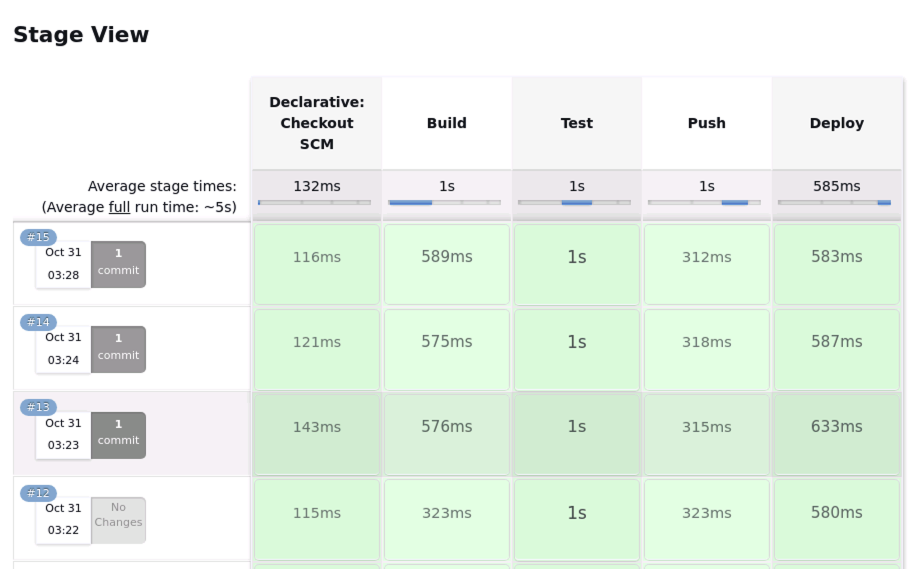

# Implementing CI/CD DevOps workflow with Jenkins for Kubernetes

In the realm of software development, Continuous Integration/Continuous Deployment (CI/CD) has become a crucial practice. This involves integrating code changes frequently, validating them with automated testing, and seamlessly deploying updates. This process allows teams to identify and address issues promptly, fostering a culture of continuous improvement.

At the heart of this practice are tools like Docker, Jenkins, and Kubernetes, each playing a vital role in the CI/CD pipeline. Docker, an open-source platform, helps in containerizing applications, ensuring they work uniformly across different systems. Jenkins, an open-source automation server, excels in implementing CI/CD pipelines, automating various stages of the software delivery process. Kubernetes, also known as K8s, is a platform that automates deployment, scaling, and management of containerized applications.

The real power emerges when these tools work in synergy. Imagine a scenario where a developer makes a code commit. Jenkins, acting as the orchestrator, detects this change and triggers a CI/CD pipeline. It begins by building a Docker image of the application. Automated tests are run against this image, ensuring the changes don't break anything. If the tests pass, Jenkins pushes the Docker image to a repository. Now, Kubernetes steps in. It pulls the image from the repository and deploys it across the clusters, ensuring high availability and scalability. If a pod fails, Kubernetes automatically replaces it, maintaining the desired state.

The purpose of this guide is to explore this powerful synergy.  

## The Setup
We tested out this workflow on an Ubuntu VM in the cloud.  We created this VM just for the purpose of writing this guide.  Most things are running as Docker containers (except Docker itself).  You can substitute any of these for non-containerized versions or SaaS versions of the softwares.  For this guide, we decided to keep it simple.  This also showcases how Docker and containers can be so powerful.
1. **OS**: Ubuntu 22.04 LTS
2. **Docker Engine**:  We followed the steps provided on Docker's website: https://docs.docker.com/engine/install/ubuntu/
3. **Kubernetes**: We used the MicroK8s (https://microk8s.io/) distribution for this workflow.  But this guide should work with any implementation as long as you have access to it using `kubectl` CLI tool.  We used this distro because it is a quick install using `snap` tool in Ubuntu.
4. **Jenkins**: Jenkins can be installed directly on your machine or can be run as a Docker container.  Running as a container has it's own set of concerns, mainly related to giving the Jenkins runtime access to Docker, Kubernetes cluster, Docker registry, etc.  *Please keep in mind that the following Docker command is specific to this guide and not how you should set up Jenkins in production environments*: 
```bash
docker run \
  --name infra-cicd \
  -d \
  -p 8080:8080 \
  -p 50000:50000 \
  -e JAVA_OPTS="-Dhudson.plugins.git.GitSCM.ALLOW_LOCAL_CHECKOUT=true" \
  -v $(which docker):/usr/local/bin/docker \
  -v ~/.kube:/root/.kube \
  -v /var/run/docker.sock:/var/run/docker.sock \
  -v jenkins_home:/var/jenkins_home \
  -v /home/demouser/labs:/labs:ro \
  --privileged \
  --user root \
  jenkins/jenkins:2.424
```
   This command does the following:
  - Runs a Docker container in detached mode (-d).
  - Names the container "infra-cicd" (--name).
  - Maps host ports 8080 and 50000 to container ports 8080 and 50000 (-p).
  - Sets a Java option for Jenkins to allow local Git checkouts (-e JAVA_OPTS).
  - Mounts Docker binary from host to the container (-v $(which docker):/usr/local/bin/docker).
  - Mounts kube config from host to the container (-v ~/.kube:/root/.kube).
  - Maps Docker socket from host to the container (-v /var/run/docker.sock:/var/run/docker.sock).
  - Maps Jenkins home directory from a named volume "jenkins_home" to the container (-v jenkins_home:/var/jenkins_home).
  - Mounts a labs directory from host as read-only into the container (-v /home/demouser/labs:/labs:ro).  This will allow our demo Jenkins instance to access and track our local Git repository with our application code in it.  You could easily skip this step and use a Git service like GitHub or GitLab.
  - Runs the container with privileged access (--privileged).
  - Runs the container as the root user (--user root).
  - Specifies the Docker image to use (jenkins/jenkins:2.424).
5. **Docker Registry**: We ran a temporary Docker Registry as a container for this with the following command: `docker run -d -p 5001:5000 --name=registry registry:2.8.3`
6. **Other Tools**: **Visual Studio** Code for creating our files and **Git** for source code management (SCM).

## Application Overview
Our application, `app.py`, is a minimal Flask web app that returns "Hello Kubernetes!" upon visiting the root URL.
```python
# app.py
from flask import Flask

app = Flask(__name__)
@app.route('/')
def hello_world():
    return 'Hello Kubernetes!'

if __name__ == '__main__':
    app.run(host='0.0.0.0', port=5000)
```
## Testing the Application
We test the application with `test_app.py`, using pytest. It makes a GET request to the root URL and checks if "Hello Kubernetes!" is returned.
```python
# test_app.py
import pytest
import app 

@pytest.fixture
def client():
    app.app.config['TESTING'] = True
    with app.app.test_client() as client:
        yield client

def test_hello_world(client):
    rv = client.get('/')
    assert b'Hello Kubernetes!' in rv.data
```
## Containerizing the Application
The `Dockerfile` defines how to build a Docker image for the app. It installs Flask and pytest, copies the app and test files, and sets the command to run the app.
```dockerfile
# Dockerfile
FROM python:3.7-slim
WORKDIR /app
RUN pip install flask pytest
COPY . /app
EXPOSE 5000
CMD ["python", "-u", "app.py"]
```

## CI/CD with Jenkins
The `Jenkinsfile` is our CI/CD pipeline script. It has four stages:

  - Build: Builds a Docker image with a tag based on the build number.  In Jenkins the `BUILD_NUMBER` represents the current build's sequence number. We will use this to increment Docker image versions using Docker tags.  The `localhost:5001` prefix allows us to push it to our local registry.  You will need to adapt this based on what your registry endpoint is (local or in the cloud).
  - Test: Runs the tests in a Docker container.
  - Push: Pushes the Docker image to a local registry running on port 5001.
  - Deploy: Substitutes the build number into `demodeploy.yaml` and applies it to Kubernetes. 
```groovy
#Jenkinsfile
pipeline {
  agent any
  stages {
    stage('Build') {
      steps {
        sh 'docker build -t localhost:5001/myapp:${BUILD_NUMBER} .'
      }
    }
    stage('Test') {
      steps {
        sh 'docker run --rm localhost:5001/myapp:${BUILD_NUMBER} python -m pytest -v test_app.py'
      }
    }
    stage('Push') {
      steps {
        sh 'docker push localhost:5001/myapp:${BUILD_NUMBER}'
      }
    }
    stage('Deploy') {
      steps {
        sh('sed "s,\\${BUILD_NUMBER},' + env.BUILD_NUMBER + ',g" demodeploy.yaml | kubectl apply -f -')
      }
    }
  }
}
```
## Deploying to Kubernetes
Jenkins will deploy the application to Kubernetes by running the `kubectl apply` command.  `demodeploy.yaml` defines a Kubernetes Deployment and Service. The Deployment runs a pod with our app's Docker image, and the Service exposes the app to the outside world.  Note: In the Deploy stage of the Jenkinsfile, we use `sed` to replace `${BUILD_NUMBER}` in `demodeploy.yaml` with the actual build number. This ensures the latest Docker image is used.

```yaml
# demodeploy.yaml
apiVersion: apps/v1
kind: Deployment
metadata:
  name: myapp-deployment
spec:
  replicas: 1
  selector:
    matchLabels:
      app: myapp
  template:
    metadata:
      labels:
        app: myapp
    spec:
      containers:
      - name: myapp
        image: localhost:5001/myapp:${BUILD_NUMBER}
        ports:
        - containerPort: 5000
---
apiVersion: v1
kind: Service
metadata:
  name: myapp-service
spec:
  type: NodePort
  selector:
    app: myapp
  ports:
    - protocol: TCP
      port: 80
      targetPort: 5000
      nodePort: 30080
```

# Setting up the Workflow
1. **Create Code Repository**: We created the above files in the `home/demouser/labs/cicd` directory of our VM so that it shows up as `/labs/cicd` within the Jenkins container based on the volume mapping we specified earlier (see the Jenkins setup section above).  We then initialized Git in the directory so we could is in the pipeline.
3. **Create a Jenkins Pipeline Project**: We used the `Pipeline script from SCM` option with the repository url set to `file:///labs/cicd`.  If you are using a remote Git service, simply point to your URL (in this case, you will need to authenticate against your service using Jenkins Credentials.  See their documentation on how).
4. **Set Build Trigger**: For our purposes, we simply used the `Poll from SCM` option set to `*/3 * * * *` for a poll every three minutes.  In real life, you would likely use a more realistic schedule or use the WebHook option.
5. You should now be able to trigger a manual build using the "Build Now" button.  Alternatively, if Jenkins notices new commits since last check, it will automatically trigger a build.  



## Summary
We hope that after reading this guide, you now have a better understanding of how to start your own CI/CD workflows using Jenkins for Kubernetes based applications.  You should be able to adapt what you learned here and replace Jenkins with any other CI/CD tool with some effort.  We wish you the best in your CI/CD Devops journey!